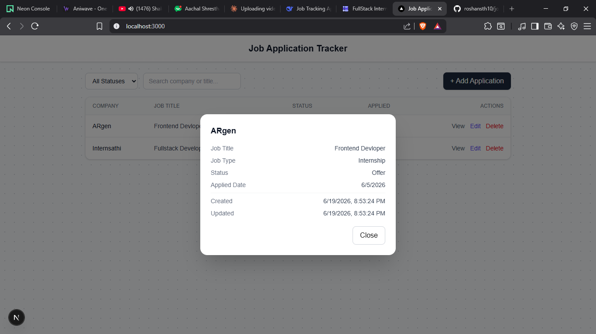

Job Application Tracker

This is my submission for the InternSathi Full Stack Internship task. The idea is simple — a small web app where you can keep track of all the jobs/internships you've applied to instead of writing it down in a notebook or some random Google Sheet (which is what I was doing before lol).
You can add an application, view all of them in a list, click on one to see full details, edit it if something changes, delete it if you want, and also filter/search through them.

Tech Stack
I went with:
Next.js (App Router) — used it for both frontend and backend (API routes), so didn't need a separate Express server
React + TypeScript
Tailwind CSS for styling, mainly because it's fast to work with
PostgreSQL as the database (hosted on Neon, free tier)
Prisma as the ORM
Zod for validating form input and API request bodies

Features:
Table view of all applications — shows company name, job title, status and applied date
"View" button opens a modal with the full details (notes, created/updated timestamps etc.)
Add new application through a form
Edit an existing application
Delete an application — added a confirm step so you don't delete something by accident
Filter list by status (Applied / Interviewing / Offer / Rejected)
Search by company name or job title

Prerequisites

Node.js 18+
A PostgreSQL database (I used Neon, but any Postgres instance should work)

Setup
Clone the repo

bash   git clone https://github.com/roshansth10/job-tracker.git
   cd job-tracker

Install dependencies
bash   npm install
Create your .env file
bash   cp .env.example .env
Then open .env and put in your own DATABASE_URL.
Run migrations to set up the tables

bash   npx prisma migrate dev

Start the dev server
bash   npm run dev
Open http://localhost:3000 in the browser.

Environment Variables
VariableDescriptionDATABASE_URLPostgreSQL connection string — see .env.example for the format

API Routes

MethodRouteDescriptionGET/api/applicationsGet all applications. Supports ?status= filter and ?search= queryGET/api/applications/:idGet a single application by idPOST/api/applicationsCreate a new applicationPATCH/api/applications/:idUpdate an existing applicationDELETE/api/applications/:idDelete an application

Database Schema

id — auto generated
companyName — required
jobTitle — required
jobType — enum: Internship / Full_time / Part_time
status — enum: Applied / Interviewing / Offer / Rejected
appliedDate — required
notes — optional
createdAt, updatedAt — handled automatically by Prisma

Screenshots

Notes

This was built within the time given for the task, so a few things like Docker setup, unit tests and live deployment were skipped to focus on getting the core CRUD + filtering + validation working properly first.

Author

Roshan Shrestha
